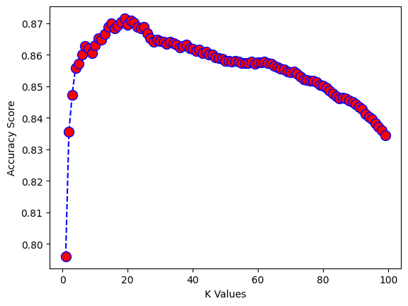

# Reporte A01423983

## Modelo escogido

Escogí el modelo de mi segunda entrega, ya que se adapta mejor a las demostraciones de las competencias. Este modelo es una predicción de regresión usando el algoritmo de K-Nearest Neighbors. El objetivo es predecir el salario una persona en base a sus años de experiencia, género, nivel de educación y edad.

## 1. Separación y evaluación del modelo con un conjunto de prueba y un conjunto de validación (Train/Test/Validation)

Después de limpiar los datos (eliminar valores nulos, eliminar columnas innecesarias, etc.) separamos los datos en dos conjuntos: uno de entrenamiento y otro de prueba. El conjunto de entrenamiento es el 95% de los datos y el conjunto de prueba es el 5% de los datos. En este caso no utilicé un conjunto de validación cómo tal, ya que no es necesario para este modelo. La librería de sklearn hace una separación del conjunto de entrenamiento en un conjunto de entrenamiento y un conjunto de validación. Se podría decir que el conjunto de validación está incluido en el conjunto de entrenamiento.

Mi entendimiento de los diferentes tipos de conjuntos es el siguiente:

- Conjunto de entrenamiento: Es el conjunto de datos que se utiliza para entrenar el modelo. Es decir, el modelo se entrena con estos datos para que pueda aprender a predecir.
- Conjunto de prueba: En el aprendizaje supervisado se utiliza este conjunto para ajustar los parámetros del modelo. Esto reduce el bias y el sesgo.
- Conjunto de validación: Este conjunto se utiliza para medir el rendimiento del modelo. Principalmente sirve cómo métrica final el modelo.

## 2. Diagnóstico y explicación del grado de bias o sesgo: bajo medio alto

En mi modelo, el sesgo se trata a través del valor de $K$. Si el valor de $K$ es muy bajo, habrá poco sesgo, pero la precisión no sería la más acertada. Por otro lado, si el valor de $K$ es muy alto, habrá mucho sesgo. Fue importante encontrar un punto óptimo entre el sesgo y el cross-validation score. En mi caso, el valor que maximizó el cross-validation score fue $K=19$. Se creó un poco de sesgo, pero la precisión fue la más alta. Diría que el sesgo es bajo-medio.

## 3. Diagnóstico y explicación el grado de varianza: bajo medio alto

Para mi modelo en específico, no existe la métrica de varianza, pero se utiliza el cross-validation score. Siempre se desea que la varianza sea baja, ya que eso permite dar predicciones constantes. Sin embargo, si la predicción es muy ajustada, pero no se acerca a los valores reales, es posible que siempre exista un error en la predicción. El resultado mostraba una precisión cercana al 0.87%. Por lo tanto, considero que la varianza es baja.

## 4. Diagnóstico y explicación el nivel de ajuste del modelo: underfitt fitt overfitt

Al maximizar el valor de $k$ evitamos tanto el underfitting como el overfitting. Conforme avanza el valor de $k$, el modelo se vuelve más preciso, evitando el underfitting. Sin embargo, si el valor de $k$ es muy grande, el modelo se vuelve muy específico y puede caer en overfitting. Es por eso por lo que la métrica de cross validation nos ayuda a encontrar el valor de $k$ que nos da el mejor balance entre overfitting y underfitting. En la gráfica previa se presenta una línea que muestra como la precisión sube y después baja. Finalmente escogemos el valor de $k$ que mejores resultados da al compararse con un set de prueba.

## Mejoras

Cómo se menciona arriba, el entendimiento de los diferentes parámetros para medir un modelo me permitió encontrar la mejor configuración de hiperparámetros. Encontré un balance entre el sesgo y la precisión. Sin embargo, el modelo aún puede mejorarse. Un punto de mejora sería aumentar la cantidad de datos. Esto permitiría que el modelo aprenda de mayores ejemplos; aumentar el tamaño de $k$ sin alcanzar un overfitting y al mismo tiempo reducir el sesgo. La mayor mejora al modelo fue encontrar el valor $k$ ideal.
